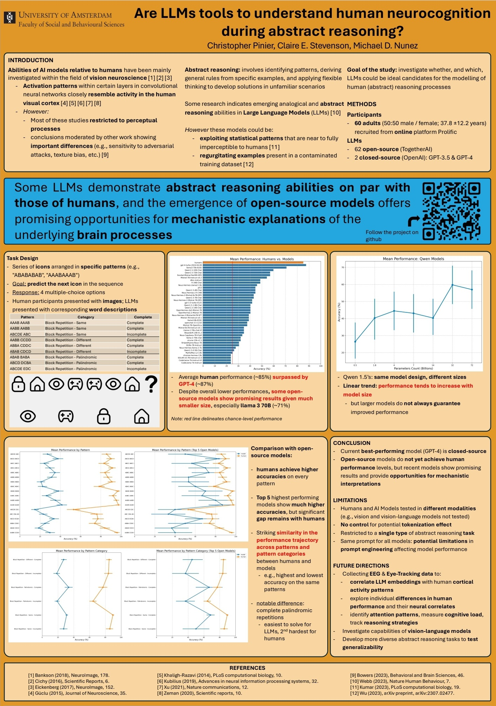

# abstract_reasoning
#### (Repository version 0.1.0)

### Organization
This project is divided into four sub-projects, each with its own python environment:

- experiment-ANNs: version of the experiment that tests Artificial Neural Networks
- experiment-Lab: in-lab version of the experiment ran with human participants
- experiment-Online: online version of the experiment ran with human participants (slightly different task design as the lab experiment)
- setup-analysis: analysis code for [this preprint](https://arxiv.org/abs/2508.10057)

### Possible citations
#### Main preprint
Pinier, C., Vargas, S. A., Steeghs-Turchina, M., Matzke, D., Stevenson, C. E., & Nunez, M. D. (2025). [Large Language Models Show Signs of Alignment with Human Neurocognition During Abstract Reasoning.](https://arxiv.org/abs/2508.10057) arXiv preprint arXiv:2508.10057.

#### 2025 CCN conference publication
Pinier, C., Stevenson, C. E., & Nunez, M. D. (2025). Moderate evidence for large language models reflecting human neurocognition during abstract reasoning [Poster session]. *Cognitive Computational Neuroscience (CCN) 2025*, Amsterdam, Netherlands. [PDF](https://2025.ccneuro.org/abstract_pdf/Pinier_2025_Moderate_evidence_large_language_models_reflecting.pdf)

#### 2024 CCN conference publication
Pinier, C., Stevenson, C. E., & Nunez, M. D. (2024). Are large language models tools to understand human neurocognition during abstract reasoning? [Poster session]. *Cognitive Computational Neuroscience (CCN) 2024*, MIT, Cambridge, MA, USA. [PDF](https://2024.ccneuro.org/pdf/123_Paper_authored_Are-LLMs-tools-to-understand-human-neurocognition-during-abstract-reasoning.pdf)

### Associated poster

