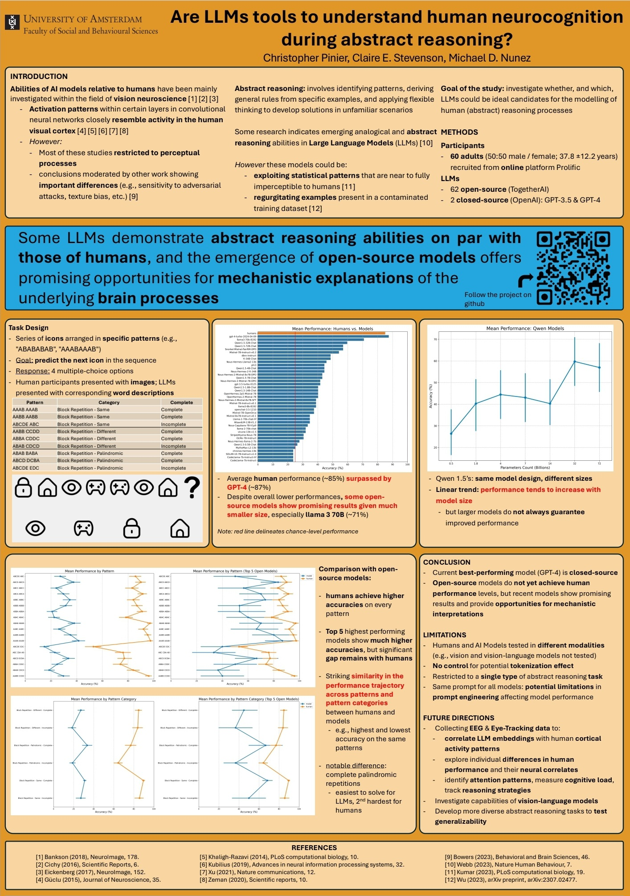

This project is divided into three sub-projects, each with its own python environment:

- experiment-ANNs: version of the experiment that tests Artificial Neural Networks
- experiment-Lab: in-lab version of the experiment ran with human participants
- experiment-Online: online version of the experiment ran with human participants (slightly different task design as the lab experiment)

